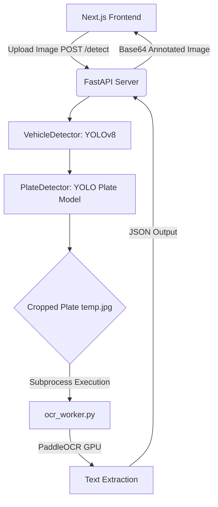

# Vehicle & License Plate Detection


An end-to-end, AI-powered vehicle detection and license plate recognition system. This project features a robust **FastAPI backend** running a three-stage AI pipeline (YOLOv8 + PaddleOCR) and a sleek, modern **Next.js frontend** designed with a premium "Obsidian Amber" dark aesthetic.

---

## 🌟 Features

- **Three-Stage AI Pipeline**: 
  1. Detects vehicles in the image (YOLOv8).
  2. Detects license plates within those vehicles (Finetuned YOLOv8).
  3. Extracts text from the cropped plates (PaddleOCR).
- **Isolated GPU Environments**: Solves notorious Windows CUDA DLL conflicts (between PyTorch and PaddlePaddle) by running the OCR engine in a completely isolated Python subprocess.
- **Premium Frontend UI**: Single-page Next.js application with drag-and-drop uploads, simulated progress indicators, and an interactive session history.
- **Visual Output**: Returns a fully annotated image directly in the UI with bounding boxes and recognized text overlaid.

---

## 🏗️ Architecture



---

## 🚀 Getting Started

### Prerequisites
- **Python 3.11+**
- **Node.js 18+**
- (Optional but Recommended) **NVIDIA GPU** with CUDA installed for hardware acceleration.

### 1. Backend Setup

Due to DLL conflicts between PyTorch and PaddleOCR on Windows, this project utilizes **two separate Python virtual environments**.

#### Environment A: PyTorch & FastAPI (`pyvenv`)
This environment runs the web server and the YOLO models.
```bash
# Create and activate environment
python -m venv pyvenv
pyvenv\Scripts\activate

# Install dependencies
pip install fastapi uvicorn python-multipart opencv-python numpy ultralytics torch torchvision
```

#### Environment B: PaddleOCR (`paddle_env`)
This environment is used strictly by the subprocess to read the license plates.
```bash
# Create and activate environment
python -m venv paddle_env
paddle_env\Scripts\activate

# Install dependencies
pip install paddlepaddle-gpu paddleocr[all]
```

### 2. Frontend Setup

```bash
cd frontend
npm install
```

---

## 💻 Usage

To run the application, you need to start both the backend server and the frontend development server.

**1. Start the FastAPI Backend**
Open a terminal in the root directory:
```bash
# Activate the main environment
pyvenv\Scripts\activate
# Start the server
uvicorn app.main:app --reload
```
*The backend will run on `http://localhost:8000`.*

**2. Start the Next.js Frontend**
Open a second terminal:
```bash
cd frontend
npm run dev
```
*The frontend will run on `http://localhost:3000`.*

Open your browser and navigate to `http://localhost:3000`. Upload an image of a vehicle to see the detection pipeline in action!

---

## 🛠️ Tech Stack

**Frontend:**
- [Next.js](https://nextjs.org/) (React Framework)
- [TailwindCSS](https://tailwindcss.com/) (Styling)
- React Hooks for state and session history

**Backend:**
- [FastAPI](https://fastapi.tiangolo.com/) (API Framework)
- [Ultralytics YOLOv8](https://github.com/ultralytics/ultralytics) (Object Detection)
- [PaddleOCR](https://github.com/PaddlePaddle/PaddleOCR) (Optical Character Recognition)
- OpenCV (Image processing & Annotation)
